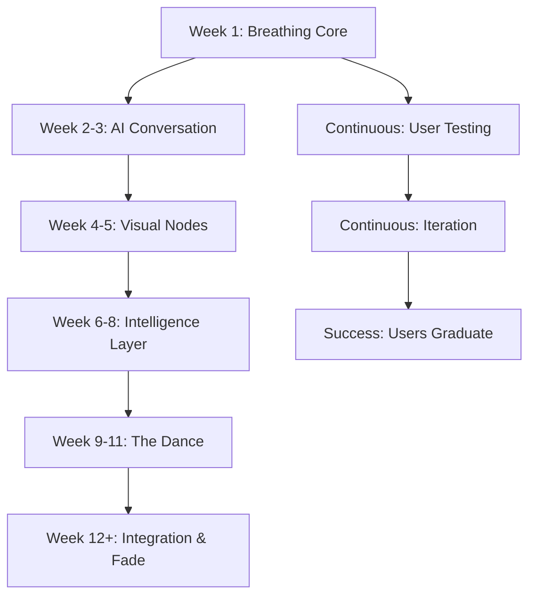

# Master Architecture: The App That Learns to Disappear

## Executive Summary
Build a conversational AI companion that helps users discover and integrate personal goals through three phases: Discovery (guide), Dance (partner), and Integration (fade). The app gradually reduces its presence as users internalize changes, measuring success by independence rather than engagement.

## Core Technical Architecture

### Tech Stack Decision
```yaml
Frontend:
  Core: React 18+ with TypeScript
  State: Zustand (simpler than Redux for our needs)
  Animation: Framer Motion (organic, physics-based)
  Styling: Tailwind CSS + CSS Variables for breathing gradients
  
Backend:
  Runtime: Node.js with Express
  Database: PostgreSQL with Prisma ORM
  AI: OpenAI GPT-4 API with custom prompt chains
  Queue: BullMQ for background processing
  Cache: Redis for session management
  
Infrastructure:
  Hosting: Vercel (frontend) + Railway (backend)
  Storage: Cloudflare R2 for user exports
  Analytics: PostHog (privacy-focused)
  Monitoring: Sentry
```

### Database Schema
```sql
-- Core Tables
users (
  id UUID PRIMARY KEY,
  created_at TIMESTAMP,
  current_phase ENUM('discovery', 'dance', 'integration'),
  personality_type VARCHAR(50),
  last_interaction TIMESTAMP,
  fade_score FLOAT -- 0-1, higher = ready to fade
)

conversations (
  id UUID PRIMARY KEY,
  user_id UUID REFERENCES users,
  message TEXT,
  response TEXT,
  emotion VARCHAR(50),
  timestamp TIMESTAMP,
  phase VARCHAR(20)
)

goals (
  id UUID PRIMARY KEY,
  user_id UUID REFERENCES users,
  raw_input TEXT, -- "I want to be happier"
  evolved_form TEXT[], -- ["morning walks", "gratitude practice"]
  state ENUM('dormant', 'suggested', 'active', 'crystallizing', 'integrated'),
  created_at TIMESTAMP,
  last_engaged TIMESTAMP,
  engagement_score FLOAT
)

patterns (
  id UUID PRIMARY KEY,
  user_id UUID REFERENCES users,
  pattern_type VARCHAR(50), -- 'morning_person', 'needs_structure', etc
  confidence FLOAT,
  discovered_at TIMESTAMP
)
```

## Implementation Phases

### Phase 0: Foundation (Week 1)
**Goal**: Breathing prototype that proves the soul

```typescript
// Core Components
BreathingBackground.tsx    // Gradient that responds to emotion
ConversationFlow.tsx       // Single question interface
EmotionDetector.ts        // Analyzes text sentiment
LocalPersistence.ts       // Browser storage before auth

// Deliverable
- Single page app
- One question: "What brought you here today?"
- Breathing gradient responds to input emotion
- No authentication required
```

### Phase 1: Conversation Engine (Week 2-3)
**Goal**: AI that feels alive

```typescript
// AI System Architecture
AICoach/
  ├── PersonalityEngine.ts     // Tracks what resonates
  ├── QuestionBank.ts          // Questions by emotional state
  ├── ResponseGenerator.ts     // Blends personality + context
  └── ConversationMemory.ts    // Maintains context

// Key Algorithm
function generateResponse(input: string, context: Context) {
  const emotion = detectEmotion(input)
  const personality = context.emergingPersonality || 'discovering'
  const phase = context.currentPhase
  
  // Personality emerges through engagement patterns
  if (context.daysSinceStart < 7) {
    testDifferentStyles(emotion)
    trackEngagement()
  }
  
  return selectResponse(emotion, personality, phase)
}
```

### Phase 2: Visual Language (Week 4-5)
**Goal**: Interface that breathes

```typescript
// Component Architecture
GoalNode.tsx           // Individual goal visualization
  ├── States: dormant | suggested | active | integrated
  ├── Animations: pulse() | bloom() | crystallize()
  └── Interactions: tap | hold | swipe

ConstellationView.tsx  // Goals orbiting around user
  ├── Physics: Spring-based positioning
  ├── Relationships: Lines between related goals
  └── Evolution: Nodes move closer/further based on engagement

TreeVisualization.tsx  // Final form for integrated habits
  ├── Growth: Branches for habits, leaves for days
  └── Seasons: Visual changes based on consistency
```

### Phase 3: Intelligence Layer (Week 6-8)
**Goal**: Adaptive system that learns

```typescript
// Learning Systems
PatternRecognition/
  ├── TemporalPatterns.ts    // Morning person? Night owl?
  ├── EngagementPatterns.ts  // What makes them return?
  ├── ResistancePatterns.ts  // What makes them leave?
  └── SuccessPatterns.ts     // What leads to integration?

FadeAlgorithm/
  ├── IndependenceRatio.ts   // Track self-directed vs prompted
  ├── AutomaticityScore.ts   // Measure habit strength
  ├── InterventionTiming.ts  // When to speak, when to stay silent
  └── GraduationDetection.ts // When user no longer needs app
```

### Phase 4: The Dance (Week 9-11)
**Goal**: Co-creative partnership

```typescript
// Advanced Features
BidirectionalLearning/
  ├── UserTeachesAI.ts       // AI learns user's language
  ├── AITeachesUser.ts       // User learns patterns
  └── CoCreation.ts          // Goals evolve together

TemporalLoops/
  ├── MicroLoop.ts   // Daily habits (hours/days)
  ├── MesoLoop.ts    // Behavior patterns (weeks)
  └── MacroLoop.ts   // Life changes (months)

RelationshipMapping/
  ├── GoalSynergyDetector.ts    // Which goals support each other
  ├── ConflictResolver.ts       // Which goals compete
  └── IntegrationPathfinder.ts  // Optimal integration order
```

### Phase 5: Integration & Fade (Week 12+)
**Goal**: Graceful disappearance

```typescript
// Fade Mechanics
DisappearanceEngine/
  ├── ReducePrompts.ts        // Fewer questions over time
  ├── SimplifyInterface.ts    // Remove features as mastery grows
  ├── TransferIntelligence.ts // Move insights to user's intuition
  └── CelebrateDeparture.ts   // Mark graduation positively

// Success Metrics
IndependenceTracking/
  ├── BehaviorFrequency.ts    // How often without prompting
  ├── AppEngagement.ts        // Inverse success metric
  └── GraduationScore.ts      // Ready to leave?
```

## Detailed Component Specifications

### 1. Breathing Background System
```javascript
class BreathingGradient {
  baseRate = 4000 // 4s breath cycle
  emotionModifiers = {
    stuck: 1.5,     // Slower breathing
    excited: 0.75,  // Faster breathing
    calm: 1.0       // Normal breathing
  }
  
  colors = {
    dawn: ['#FFF5E6', '#FFD4A3', '#FFA668'],
    day: ['#87CEEB', '#98D8E8', '#B0E0E6'],
    dusk: ['#FF6B6B', '#FF8787', '#FFA0A0'],
    night: ['#2C3E50', '#34495E', '#46627F']
  }
  
  animate() {
    // CSS variables for GPU-accelerated gradients
    // Respond to emotion in real-time
    // Sync with time of day
  }
}
```

### 2. Question Banking System
```typescript
interface QuestionBank {
  discovery: {
    opening: string[]
    stuck: { tier1: string[], tier2: string[], tier3: string[] }
    excited: { tier1: string[], tier2: string[], tier3: string[] }
    uncertain: { tier1: string[], tier2: string[], tier3: string[] }
  }
  dance: {
    // More co-creative questions
  }
  integration: {
    // Minimal, deep questions
  }
}

// Intelligent selection
function selectQuestion(emotion: Emotion, phase: Phase, history: History) {
  // Never repeat recent questions
  // Increase depth over time
  // Match personality style
}
```

### 3. Goal State Machine
```typescript
class GoalStateMachine {
  states = {
    dormant: {
      next: ['suggested'],
      ui: { opacity: 0.2, pulse: false }
    },
    suggested: {
      next: ['active', 'dormant'],
      ui: { opacity: 0.5, pulse: 'gentle' }
    },
    active: {
      next: ['crystallizing', 'dormant'],
      ui: { opacity: 1.0, pulse: 'regular' }
    },
    crystallizing: {
      next: ['integrated', 'active'],
      ui: { opacity: 0.8, pulse: 'slow' }
    },
    integrated: {
      next: [], // Terminal state
      ui: { opacity: 0.0, pulse: false } // Disappeared
    }
  }
  
  transition(goal: Goal, trigger: Trigger) {
    // Based on engagement patterns
    // Time in current state
    // User feedback
  }
}
```

### 4. Personality Emergence Algorithm
```typescript
class PersonalityEmergence {
  indicators = {
    prefersQuestions: 0,
    prefersDirections: 0,
    prefersMetaphors: 0,
    prefersPractical: 0
  }
  
  trackEngagement(response: Response, engagement: Engagement) {
    // Longer responses = resonance
    // Questions back = curiosity
    // Return next day = connection
    // Emotional expression = trust
  }
  
  emergePersonality() {
    if (daysSinceStart > 7 && maxConfidence > 0.7) {
      return dominantPersonality
    }
    return 'discovering'
  }
}
```

### 5. Fade Algorithm
```typescript
class FadeAlgorithm {
  calculateIndependence(user: User) {
    const ratio = daysPracticed / daysOpenedApp
    const automaticity = avgTimeToAction
    const consistency = streakStability
    
    return {
      readyToFade: ratio > 0.7 && automaticity < 2,
      fadeRate: calculateOptimalFadeRate(),
      nextIntervention: determineNextTouch()
    }
  }
  
  executePhase(phase: 'maintain' | 'reduce' | 'disappear') {
    switch(phase) {
      case 'reduce':
        // Weekly instead of daily
        // One question instead of three
        // Simpler interface
      case 'disappear':
        // Monthly check-in only
        // Export option prominent
        // Celebration message
    }
  }
}
```

## User Experience Flow

### First Session Architecture
```
1. Load → Breathing gradient (no splash)
2. Question appears → "What brought you here today?"
3. User types → Gradient responds to emotion
4. AI responds → Follow-up question
5. 3-5 exchanges → "Should I remember this?"
6. Soft account creation → Continue conversation
```

### Daily Rhythm Architecture
```
Morning Person:
- 7am: Gentle notification (if enabled)
- Open: "What wants attention today?"
- Interact: 1-3 nodes maximum
- Close: Nodes pulse acknowledgment

Evening Person:
- 8pm: Reflection prompt
- Open: "What surprised you today?"
- Review: Day's patterns visible
- Close: Tomorrow's possibility
```

### Evolution Architecture
```
Week 1: Single question interface
Week 2: First node appears
Week 3: Three nodes maximum
Week 4: Constellation view emerges
Week 8: Patterns become visible
Week 12: Interface simplifies
Week 16: Tree view available
Week 20: Fade begins
Week 24: Monthly check-ins only
```

## Critical Implementation Notes

### Performance Requirements
- First paint < 1.5s
- Interaction response < 100ms  
- Animation at 60fps always
- Works offline after first load
- Mobile-first responsive

### Privacy & Ethics
- All data encrypted at rest
- Export everything anytime
- Delete everything instantly
- No dark patterns
- No addictive mechanics
- Success = user leaves

### Monitoring Success
```typescript
// What we measure
const successMetrics = {
  independenceRatio: daysPracticed / daysOpenedApp,
  goalEvolution: goalsBecameIdentity / goalsCreated,
  phaseProgression: usersReachedIntegration / totalUsers,
  gracefulExits: graduations / totalExits
}

// What we DON'T measure
const ignoredMetrics = [
  'dailyActiveUsers',    // Want this to decrease
  'sessionLength',       // Shorter is better
  'totalGoalsCreated',   // Maximum 3
  'notificationClicks'   // Minimal notifications
]
```

## Development Workflow

### Sprint Structure
```
Sprint 1: Breathing Prototype
- Build gradient system
- Implement question flow
- Test emotional resonance

Sprint 2: Conversation Intelligence
- Integrate GPT-4
- Build personality system
- Test emergence patterns

Sprint 3: Visual Language
- Create node components
- Build constellation view
- Test interaction patterns

Sprint 4: Learning Systems
- Pattern recognition
- Fade algorithm
- Independence tracking

Sprint 5: Polish & Poetry
- Refine animations
- Perfect timing
- User testing

Sprint 6: Launch Preparation
- Performance optimization
- Privacy compliance
- Export systems
```

## Testing Protocol

### Automated Tests
```typescript
// Core test suites
describe('Breathing System', () => {
  it('responds to emotion within 100ms')
  it('maintains 60fps during animation')
  it('synchronizes with time of day')
})

describe('Personality Emergence', () => {
  it('detects patterns after 5 days')
  it('never forces personality choice')
  it('adapts to resistance signals')
})

describe('Fade Algorithm', () => {
  it('reduces presence gradually')
  it('celebrates independence')
  it('allows re-engagement if needed')
})
```

### User Testing Phases
1. **Alpha**: 5 users, daily interviews
2. **Beta**: 50 users, weekly surveys
3. **Soft Launch**: 500 users, behavior analysis
4. **Public**: Monitor independence metrics

## The Build Order



## Final Architecture Principles

1. **Build for disappearance, not retention**
2. **Measure independence, not engagement**
3. **Create presence, not features**
4. **Transfer intelligence, not dependence**
5. **Celebrate graduation, not continuation**

## Handoff to Coding Agent

"Build a React TypeScript application with a Node.js backend that creates a conversational AI companion for personal growth. Start with Phase 0: a breathing gradient background and single question interface. The app should feel alive through organic animations and thoughtful AI responses. Every technical decision should prioritize user independence over app engagement. Success is when users no longer need the app."

Begin with `BreathingBackground.tsx` and `ConversationFlow.tsx`. Make it breathe.
